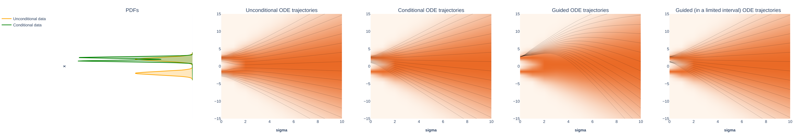

# 1D ODE



# Overview

This repository contains Python code for solving and visualizing Ordinary Differential Equations (ODEs) curvatures as formulated by Karras et al. [[1]('https://arxiv.org/abs/2011.13456')] for 1D distributions, such as Gaussian mixtures. Also this code enables guidance in a limited interval explored by Kynkäänniemi et al. [[2](https://arxiv.org/abs/2404.07724)].


The “probability flow” Ordinary Differential Equation:

$\text{d}\text{\bf x} = [\frac{\dot{\text{s}}(\text{t})}{\text{s}(\text{t})} \text{\bf x} - \text{s}(\text{t})^2 \dot{\sigma}\text(t) \sigma(\text{t}) \nabla_{\text{\bf x}}\text{log p}(\frac{\text{\bf x}}{\text{s}(\text{t})}; \sigma(\text{t}))]$


# Usage
Note for solving the ODE using conditional data PDF you can set `--cond True`. You may also use `--guidance_scale` and `--guidance_interval` to add guidance in a limited interval.

```.bash
python main.py --cond True --guidance_scale 7 --guidance_interval 0.1 0.6
``` 


# References
- [[1]('https://arxiv.org/abs/2011.13456')] T. Karras, M. Aittala, T. Aila, S. Laine. Elucidating the Design Space of Diffusion-Based Generative Models.
- [[2](https://arxiv.org/abs/2404.07724)] T. Kynkäänniemi, M. Aittala, T. Karras, S. Laine, T. Aila, J. Lehtinen. Applying Guidance in a Limited Interval Improves Sample and Distribution Quality in Diffusion Models.
- [[3]('https://arxiv.org/abs/2011.13456')] Y. Song, J. Sohl-Dickstein, D. P. Kingma, A. Kumar, S. Ermon, B. Poole. Score-Based Generative Modeling through Stochastic Differential Equations.


